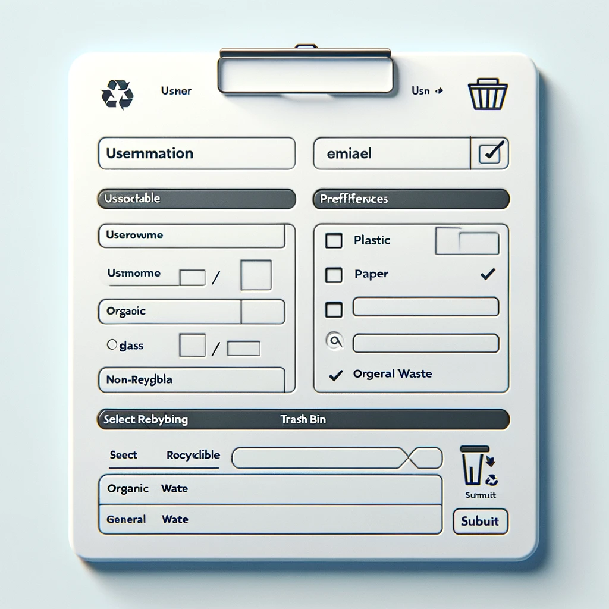

# Sort the Trash Automatically


## Description
This project aims to create an interactive web form that allows users to input their details and preferences for sorting trash automatically. It demonstrates the use of various HTML form elements, including text inputs, email inputs, telephone inputs, checkboxes, and a dropdown select menu. The form dynamically displays the user's input upon submission using JavaScript.


## Features
- User information input fields (Name, Email, Phone Number)
- Sorting preferences checkboxes (Recyclable, Organic Waste, Non-Recyclable)
- Dropdown menu for selecting the type of trash bin
- Dynamic display of submitted form data

## Technologies Used
- HTML
- CSS
- JavaScript

## Usage

1. **Clone the repository:**
   ```sh
   git clone https://github.com/kvnbbg/sort-the-trash.git
   ```

2. **Navigate to the project directory:**
   ```sh
   cd sort-the-trash
   ```

3. **Open `index.html` in your web browser:**
   ```sh
   open index.html
   ```

## File Structure
```
sort-the-trash/
├── index.html
├── styles.css
└── script.js
```

### `index.html`
Contains the structure of the web form, divided into three sections: User Information, Sorting Preferences, and Select Trash Bin.

### `styles.css`
Contains the CSS styles for the web form, providing a clean and consistent look for the form and its elements.

### `script.js`
Contains the JavaScript code that adds dynamic interaction to the form. It handles form submission, prevents the default behavior, collects input values, and displays them in a formatted output div.

## Code Explanation

### HTML
The HTML document includes a form with multiple fieldsets and input types, aligning with the trash sorting theme. It uses various input elements such as text, email, tel, checkboxes, and a select menu.

### CSS
The CSS file provides styling for the form, ensuring a clean and user-friendly interface. It styles the fieldsets, labels, input fields, checkboxes, and submit button.

### JavaScript
The JavaScript file adds an event listener to the form submission. When the form is submitted, it prevents the default behavior, collects the input values, and displays them in a formatted output div.

## Example
After filling out the form and submitting, the page will display the user's input in a structured format, confirming the details entered by the user.

## Contributions
Contributions are welcome! Please fork the repository and create a pull request with your changes.

## License
This project is open-source and available under the [MIT License](LICENSE).
